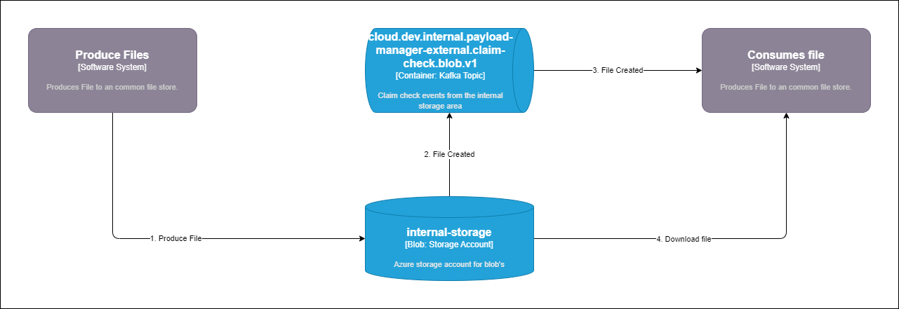

---
tags:
- integration
- payload-manager
---
# Payload Manager

[TOC]

Payload Manager is a service supported by the Integration Team for handling file transfer between services. This solves the `claim check pattern` where services can upload a file to a managed storage container and a claim check event is generated onto a Kafka topic. Other systems can then subscribe to said Kafka topic, receive information when a new file is available, and download the file themselves from the storage account.

Services `should` use the Confluent Platform for async communications, but as a way of working towards this goal, the Payload Manager can be used as a temporary solution. There might also be cases where it is not possible to use Kafka as the main way of transferring data, for example, if large pictures or video files need to be moved. For these cases, the Payload Manager can be used as the main solution for moving data.

## General Overview

A general overview of the `claim check` pattern in Bane NOR:

## Get started

To get started with the payload manager, check out our getting started guide:
[Getting started](Getting-Started/)
